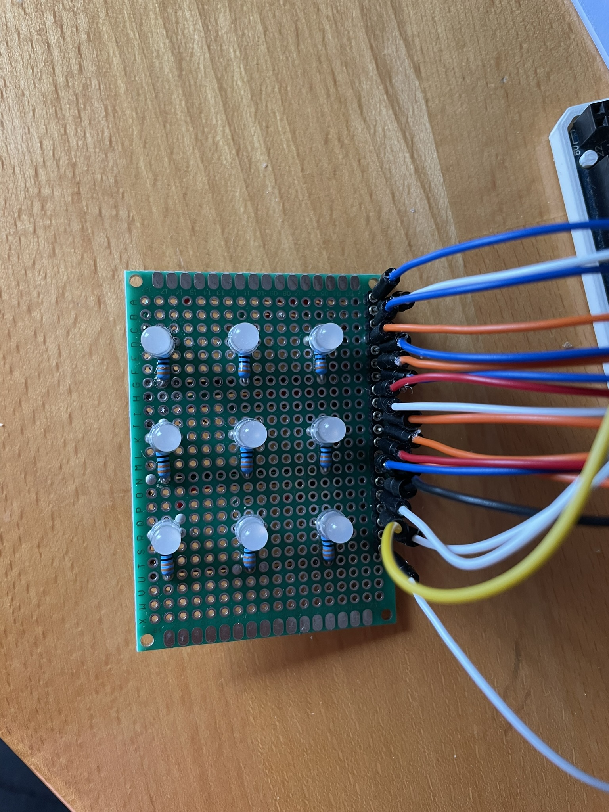
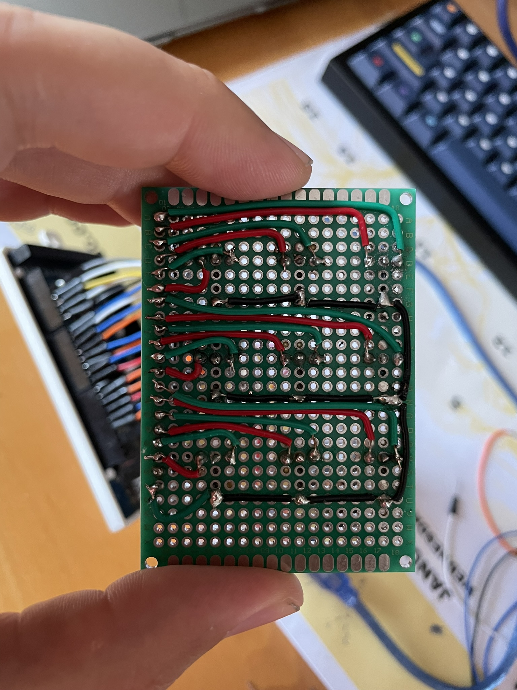

# Križec krožec (Tic Tac Toe)

### Amadej Milićev, 63210381

## Uvod

Kot svoj projekt pri predmetu VIN sem se odločil izdelati igro Tic Tac Toe oz. po domače "križec krožec".
V projekt sem želel na nek način vključiti joystick oz. t.i. igralno palico, saj se mi zdi intuitivni način za upravljanje dogajanja na zaslonu oz. v tem primeru druge vrste prikaznem elementu. Pojavila se je tudi ideja, da izkoristim zaslon na dotik STM32H7, a se mi ideja preprosto ni zdela zabavna. Tako sem se odločil svojo igro uresničiti s preprostimi dvobarvnimi diodami ter prej omenjeno igralno palico.

Osnovna ideja je ta. Ko je igralec na potezi in je na določeni poziciji, na tej poziciji utripa LED dioda njegove barve (za 1. igralca zelena, za 2. igralca modra). Če se odloči, da bo svoj križec oz. krožec postavil na trenutno pozicijo, to potrdi s pritiskom na gumb. V tem trenutku trenutna pozicija neha utripati temveč se obarva z barvo trenutnega igralca. Program postavi trenutno pozicijo na začetek mreže in najde prvo pozicijo, ki ni zasedena. Nato začne utripati v barvi naslednjega igralca. V kolikor se igralec ne odloči za postavitev svojega križca oz. krožca temveč se premakne, mu program v željeni smeri premika najde naslednjo prosto pozicijo, na katero lahko postavi svoj križec ali krožec. Po vsaki postavitvi igra preveri zmagovalne pogoje (tri enaki simboli v treh zaporednih pozicijah) in polnost mreže, kar pomeni neodločen izzid. V primeru zmage igra trikrat ponovi zmagovalno kombinacijo in se ponastavi.

Delovanje si lahko ogledate tudi prek videoposnetka.

https://youtu.be/5J8vaOJQpiM

Povezava tudi do git repozitorija.

https://github.com/Amadej99/ArduinoTicTacToe

## Potrebujemo

- Arduino (MEGA ali UNO z demultiplekserjem, če se počutimo malo bolj avanturistično.)
- 9 dvobarvnih diod (lahko so dvo ali eno-katodne)
- 9 uporov 330ohm
- igralno palico (idealno z gumbom)
- 24 žičk za povezave
- testna ploščica (breadboard)

## Vezava

- LED diode postavimo v 3x3 mrežo, nato pa jih prek uporov povežemo na ozemljitev (GND)
- S pomočjo žičk povežemo katode diod na digitalne pine Arduina. Da nam bo programiranje lažje si pine organiziramo. Tako si za levo zgornjo diodo za modro barvo izberemo pin 0, za rdeco barvo pin 1, za zgornjo srednjo diodo pa pina 2 in 3. To nam poenostavi programiranje.
- Na ozemljitveno linijo (GND oz -) povežemo GND pin arduina.
- Na arduino povežemo še joystick. X in Y os povežemo na dva analogna pina, gumb pa na digitalni pin.

Na naslednji sliki lahko vidimo postavitev LED diod. Vsaka katoda je na hrbtni strani vezana s svojim digitalnim izhodom Arduina.



Na naslednji sliki lahko vidimo vezavo LED diod, zelene žice so zelene diode, rdeče pa rdeče.
Vidimo lahko da so vedno vezane v zaporedju najprej zelena kasneje rdeča. Osebno sem jih vezal kar na letvico, v zaporednem vrstnem redu. Črne žičke povezujejo upore, ki so vezani na anode, z ozemljitvijo (GND).



Na naslednji sliki lahko vidimo zgoraj opisano povezavo igralne palice.
Če ponovimo, sta X in Y osi vezana na poljubna analogna vhoda, gumb pa na poljuben digitalni vhod.


## Programska oprema

### Uvod

Na tej točki, ko imamo fizično oz. strojni del projekta rešen, se je treba posvetiti težjemu delu. Programski opremi.
Sam sem trmasto sklenil, da ne bom brskal po internetu ampak si bom implementacijo zamislil sam. Verjetno je rezultat tega slabša ali neoptimizirana koda, vendar je vsaj zrasla na mojem zeljniku.

### Inicializacija

Najprej potrebujemo sistem za upravljanje z digitalnimi izhodi Arduina. Natančneje jih potrebujemo 19. 9 \* 2 za zeleno in rdečo barvo LED diod ter 1 za gumb naše igralne palice.
Da bo programiranje bolj preprosto si je smiselno teh 18 izhodov primerno organizirati. Odločil sem se za dvodimenzionalen seznam.

```c
// PINi LED LUCK
int LEDs[][6] = {{0, 1, 2, 3, 4, 5}, {6, 7, 8, 9, 10, 11}, {12, 13, 14, 15, 16, 17}};
```

Potrebno si je tudi beleziti kateri igralec je na potezi. Za to se mi je zdelo elegantno uporabiti enumeratorje.
Kasneje nam pridejo prav tudi pri premikanju med diodami.

```c
// POTEZA
enum states
{
  FIRST,
  SECOND,
  OVER,
  NONE
};

// SMER PREMIKANJA
enum direction
{
  LEFT,
  RIGHT,
  UP,
  DOWN,
  STILL
};

// OS
enum axis
{
  X,
  Y
};
```

Prav tako rabimo na nek način beležiti že porabljena mesta na naši mreži torej že prižgane lučke.
Lahko bi seveda uporabili že prej inicializirani seznam uporabljenih izhodov vendar bi bilo programiranje tako, vsaj po mojem mnenju, oteženo.

```c
// STANJE MREZE 3x3
states arrayStatus[][3] = {{NONE, NONE, NONE}, {NONE, NONE, NONE}, {NONE, NONE, NONE}};
```

Ideja je torej, da se premikamo le s pomočjo mreže zasedenosti, ter s pomočjo trenutne pozicije v mreži zasedenosti prižgemo pravilno LED diodo. Tako bo torej za potezo prvega igralca zasvetila [m][n * 2] dioda, za drugega igralca pa [m][n * 2 + 1] pri čemer m predstavlja vrstico igre, n pa stolpec.
Pri poziciji [0][0] (zgoraj levo) bo torej za prvega igralca utripala dioda [0][0], za drugega pa dioda
[0][1].
Pri poziciji [1][1] (srednja na sredini) bo torej za prvega igralca utripala dioda [1][2], za drugega pa dioda [1][3].

Kot vidimo, so za posamezen stolpec barve prvega igralca na poziciji m, barve drugega igralca pa na m + 1. Za to smo poskrbeli prej, ko smo posamezne diode vezali na letvico v zaporednem vrstnem redu, nato pa letvico v zaporednem vrstnem redu na Arduino.

```c
currentState == FIRST ? digitalWrite(LEDs[i][j * 2], HIGH) : digitalWrite(LEDs[i][j * 2 + 1], HIGH);
```

Inicializiramo še začetnega igralca, ter časovne spremenljivke za pravlilno delovanje istočasnega utripanja lučk in branja igralne palice. Igra začne na levi zgornji diodi.

```c
// POZICIJA
int i = 0;
int j = 0;

// INICIALIZACIJA POTEZE - ZACNE PRVI
states currentState = FIRST;

unsigned long previousMillis = 0; // Shrani zadnji preklop lucke
const long interval = 1000;       // Interval utripanja v ms

unsigned long joystickPreviousMillis = 0; // Shrani zadnje branje iz joysticka
const long joystickInterval = 100;        // Zakasnitev med naslednjim branjem joysticka v ms
```

Vse kar preostanje je dejanska inicializacija izhodov na Arduinu.

```c
void setup()
{
  // INICIALIZACIJA VSEH 18 DIGITALNIH PINOV
  for (int i = 0; i < 3; i++)
  {
    for (int j = 0; j < 6; j++)
    {
      pinMode(LEDs[i][j], OUTPUT);
      digitalWrite(LEDs[i][j], LOW);
    }
  }

  button.begin();
}
```

S tem smo zaključili prvo fazo - inicializacijo.

### Pomožne funkcije

Pri pravilnem delovanju programa je smiselna uporaba pomožnih funkcij.

Prva in glavna je funkcija, ki bo brala našo igralno palico in interpretirala prebran signal.

Najprej nam pomaga funkcija za interpretacijo signala. Podamo ji prebrano številsko vrednost, pove pa nam kam se je potrebno premakniti. Meje za pravilno interpretacijo se nastavi na neko zanesljivo, nedvoumno raven.

Funckija za branje igralne palice najprej preveri, ali je gumb pritisnjen. V kolikor je, je potrebno trenutno LED diodo prižgati,
preveriti ali je igralec s potezo zmagal, v kolikor ni, pozicijo označiti kot zasedeno, se premakniti na začetek mreze ter potezo prepustiti drugemu igralcu.

Poseben primer je tudi polna zasedenost mreže. Ob pritisku na gumb preverimo tudi to, saj je njen rezultat neodločen izid. Igro v takem primero ponastavimo na začetne vrednosti.

V kolikor gumb ni pritisnjen je treba delati z analognimi vrednostmi oz. s premikanjem. Če je igralna palica na miru ne naredimo ničesar.
Če se igralna palica premakne v eno od štirih možnih smeri je potrebno najti prvo prosto pozicijo v tisti smeri. Pred samim premikom je seveda potrebno ugasniti diodo na kateri se trenutno nahajamo, saj ni bila izbrana.

```c
// Interpretiraj prebrano vrednost iz joysticka
// Meje nastavimo na nedvoumno vrednost, da je interpretacija zanesljiva
enum direction interpretValue(int value, enum axis currentAxis)
{
  if (value > 900)
    return currentAxis == X ? RIGHT : DOWN;
  if (value < 100)
    return currentAxis == X ? LEFT : UP;
  return STILL;
}

// Preberi vrednost iz joysticka in preveri, ce je bila pritisnjena tipka
void readJoystick()
{
  // Preberi in interpretiraj prebrano vrednost
  enum direction xValue = interpretValue(analogRead(VRX_PIN), X);
  enum direction yValue = interpretValue(analogRead(VRY_PIN), Y);
  // Preberi gumb
  button.read();

  // Ce je gumb pritisnjen, prizgi LED diodo igralca na potezi
  // Preveri ali je igralec zmagal ali je mreza polna (neodlocen izzid)
  if (button.pressed())
  {
    currentState == FIRST ? digitalWrite(LEDs[i][j * 2], HIGH) : digitalWrite(LEDs[i][j * 2 + 1], HIGH);
    arrayStatus[i][j] = currentState;

    if (checkWin(currentState))
    {
      reset();
    }
    else if (checkFull())
    {
      reset();
    }
    else
    {
      // Ce nihce ni zmagal, mreza pa ni polna, je na vrsti naslednji igralec
      currentState = (currentState == FIRST) ? SECOND : FIRST;
      // Pomaknemo se na zacetno LED diodo in najdemo naslednje prosto mesto
      i = 0;
      j = 0;
      if (arrayStatus[i][j] != NONE)
        moveToFreeSpot(RIGHT);
      return;
    }
  }

  // Premaknemo se na izbrano LED diodo
  moveToFreeSpot(xValue);
  moveToFreeSpot(yValue);
}
```

Zmago preverimo z naivnim, a za našo uporabo čisto ustreznim algoritmom. Ob zmagi naj utripa zmagovalna kombinacija pozicij v barvi zmagovalca.

```c
// Preveri, ce je igralec zmagal
// Pristop je ponovno naiven
bool checkWin(states player)
{
  // Preveri vrstice in stolpce
  for (int i = 0; i < 3; i++)
  {
    // Preveri vrstice
    if (arrayStatus[i][0] == player && arrayStatus[i][1] == player && arrayStatus[i][2] == player)
    {
      int winningLEDs[3];
      for (int j = 0; j < 3; j++)
      {
        winningLEDs[j] = currentState == FIRST ? LEDs[i][j * 2] : LEDs[i][j * 2 + 1];
      }
      blinkWinningLEDs(winningLEDs);
      return true;
    }

    // Preveri stolpce
    if (arrayStatus[0][i] == player && arrayStatus[1][i] == player && arrayStatus[2][i] == player)
    {
      int winningLEDs[3];
      for (int j = 0; j < 3; j++)
      {
        winningLEDs[j] = currentState == FIRST ? LEDs[j][i * 2] : LEDs[j][i * 2 + 1];
      }
      blinkWinningLEDs(winningLEDs);
      return true;
    }
  }

  // Preveri diagonali
  if (arrayStatus[0][0] == player && arrayStatus[1][1] == player && arrayStatus[2][2] == player)
  {
    int winningLEDs[3];
    for (int j = 0; j < 3; j++)
    {
      winningLEDs[j] = currentState == FIRST ? LEDs[j][j * 2] : LEDs[j][j * 2 + 1];
    }
    blinkWinningLEDs(winningLEDs);
    return true;
  }

  if (arrayStatus[0][2] == player && arrayStatus[1][1] == player && arrayStatus[2][0] == player)
  {
    int winningLEDs[3];
    for (int j = 0; j < 3; j++)
    {
      winningLEDs[j] = currentState == FIRST ? LEDs[j][2 * (2 - j)] : LEDs[j][2 * (2 - j) + 1];
    }
    blinkWinningLEDs(winningLEDs);
    return true;
  }

  // Ni zmagovalca
  return false;
}

// Utripaj zmagovalno kombinacijo
void blinkWinningLEDs(int LEDs[])
{
  reset();
  for (int k = 0; k < 3; k++)
  {
    for (int i = 0; i < 3; i++)
    {
      digitalWrite(LEDs[i], HIGH);
    }
    delay(1000);
    for (int i = 0; i < 3; i++)
    {
      digitalWrite(LEDs[i], LOW);
    }
    delay(1000);
  }
}
```

V primeru polne mreže jo ponastavimo.

```c
// Ponastavi igro - ugasne vse LED diode in nastavi stanje na zacetno, prvi igralec na potezi
void reset()
{
  for (int i = 0; i < 3; i++)
  {
    for (int j = 0; j < 3; j++)
    {
      arrayStatus[i][j] = NONE;
      digitalWrite(LEDs[i][j * 2], LOW);
      digitalWrite(LEDs[i][j * 2 + 1], LOW);
    }
  }
  i = 0;
  j = 0;
  currentState = FIRST;
  loop();
}
```

Ob premiku iščemo naslednjo prosto pozicijo in začnemo z utripanjem diode prave barve na najdeni poziciji.

```c
// Funkcija najde naslednjo prosto LED diodo v mrezi
void moveToFreeSpot(enum direction currentDirection)
{
  // Ce ostanemo na mestu
  if (currentDirection == STILL)
    return;

  // Potrebno je ugasniti trenutno LED diodo preden se premaknemo
  if (arrayStatus[i][j] == NONE)
  {
    currentState == FIRST ? digitalWrite(LEDs[i][j * 2], LOW) : digitalWrite(LEDs[i][j * 2 + 1], LOW);
  }

  // Se izvaja dokler ne najdemo proste LED diode
  while (true)
  {
    if (currentDirection == LEFT)
    {
      j--;
      if (j < 0)
      {
        i++;
        j = 2;
      }
    }
    else if (currentDirection == RIGHT)
    {
      j++;
      if (j > 2)
      {
        i++;
        j = 0;
      }
    }
    else if (currentDirection == DOWN)
    {
      i++;
      if (i > 2)
      {
        i = 0;
      }
    }
    else if (currentDirection == UP)
    {
      i--;
      if (i < 0)
      {
        i = 2;
      }
    }

    // Preveri ali je trenutna pozicija znotraj mreze in ali je LED dioda ugasnjena
    if (i >= 0 && i <= 2 && j >= 0 && j <= 3 && arrayStatus[i][j] == NONE)
    {
      break; // Izstopi, ce je, saj smo nasli iskano pozicijo.
    }
  }

  // Zacni z utripanjem trenutne LED diode
  currentState == FIRST ? digitalWrite(LEDs[i][j * 2], HIGH) : digitalWrite(LEDs[i][j * 2 + 1], HIGH);
}
```

Vse kar nam preostane je zanka, ki se ponavlja nenehno.

```c
void loop()
{
  // Preveri, ce je LED dioda prizgana ali ugasnjena enako ali dlje kot doloceni interval.
  // Ce je, jo preklopi glede na igralca na potezi
  unsigned long currentMillis = millis();
  if (currentMillis - previousMillis >= interval)
  {
    previousMillis = currentMillis;
    if (currentState == FIRST)
      digitalWrite(LEDs[i][j * 2], !digitalRead(LEDs[i][j * 2]));
    else
      digitalWrite(LEDs[i][j * 2 + 1], !digitalRead(LEDs[i][j * 2 + 1]));
  }

  // Preveri, ce je pretekel interval za branje iz joysticka
  // Ce je, ga preberi
  unsigned long joystickCurrentMillis = millis();
  if (joystickCurrentMillis - joystickPreviousMillis >= joystickInterval)
  {
    joystickPreviousMillis = joystickCurrentMillis;
    readJoystick();
  }
}
```

### Zaključek

Projekt se mi zdi dobro izveden in sem nanj na nek način ponosen.
Za razliko od programske opreme, ki teče na spletu oz. na PCju je zanimivo videti, kako programska oprema, ki si jo sam napisal teče v "fizični obliki". Profesor mi je dejal, da je pomembno, da sem jaz zadovoljen s svojim izdelkom in ta cilj sem dosegel.
